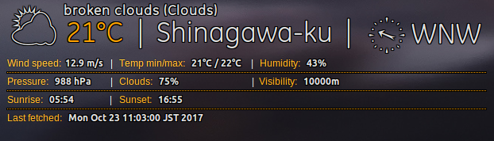

# Conky SimpleForecast

<div align="center"></div>


I reinvented the wheel and rewrote the [conkyForecast](https://ubuntuforums.org/showthread.php?t=869328) plugin in pure `bash`.
The legacy conkyForecast used the weather.com and conkyForecastWU used the weatherunderground. It was written in python as when I opened up the code I was horrified so I quickly reimplemented it in bash.

The ConkySimpleForecast uses the [openweathermap.org's](https://openweathermap.org) REST api.


## Dependencies

The only dependencies are `curl` and `jq`.

You can install them via

```bash
$ sudo apt-get install curl jq
```

## Install

```bash
$ mkdir -p ~/.conky
$ git clone https://github.com/woohgit/conkySimpleForecast.git ~/.conky/
$ cd ~/.conky/conkySimpleForecast
$ sudo make install
$ fc-cache -fv
```

## Configuration

The configuration is made via the `config.json`.

```json
{
	"api_key": "OPEN_WEATHERMAP_API_KEY",
	"cache_dir": "/tmp/conky",
	"city_id": "1852140",
	"language": "en",
	"location": "",
	"units": "metric",
	"type": "current"
}
```
##### api_key

Get a free `API_KEY` at [openweathermap.org](https://openweathermap.org/appid).

##### cache_dir

This is where the conkySimpleForecast stores the temporary data.

##### city_id

The latest city list can be found here: [current.city.list.json.gz](http://bulk.openweathermap.org/sample/current.city.list.json.gz). 

One of the `city_id` or the `location` should be defined.

##### language

Currently the supported languages are:

	Arabic - ar, Bulgarian - bg, Catalan - ca, Czech - cz, German - de, Greek - el, English - en, Persian (Farsi) - fa, Finnish - fi, French - fr, Galician - gl, Croatian - hr, Hungarian - hu, Italian - it, Japanese - ja, Korean - kr, Latvian - la, Lithuanian - lt, Macedonian - mk, Dutch - nl, Polish - pl, Portuguese - pt, Romanian - ro, Russian - ru, Swedish - se, Slovak - sk, Slovenian - sl, Spanish - es, Turkish - tr, Ukrainian - ua, Vietnamese - vi, Chinese Simplified - zh_cn, Chinese Traditional - zh_tw.

##### location

The name of your city like: `Tokyo,jp` or `London,gb` or `Budapest,hu`.

One of the `city_id` or the `location` should be defined.

##### units

`metric` or `imperial`.

##### type

Currently only the `current` is supported, the `forecast` aturefe is in development.

## How to run

Once everything is configured you can run it easily:

```bash
$ cd ~/.conky/conkySimpleForecast
$ ./run
```

## Special thanks to

- [@kaivalagi](https://github.com/kaivalagi) for his original work

## Credits

- I borrowed the ConkyWeather.otf and ConkyWind.otf from the original conkyForecast. Credit goes to [@kaivalagi](https://github.com/kaivalagi).